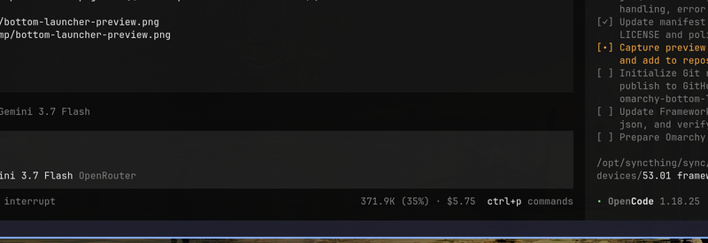

# Omarchy Bottom Launcher

A fast, rising window switcher and launcher plugin for Omarchy on Hyprland, built with Quickshell.



## Features

- **Dual Activation Triggers**:
  - **Mouse Hover**: Move your cursor down to the bottom-middle third of the focused monitor to reveal the floating launcher.
  - **Keyboard Shortcut**: Native `Alt+Tab` / `Alt+Shift+Tab` integration with MRU (most-recently-used) window cycling.
- **Instant Window Switching**:
  - Releasing `Alt` automatically raises and focuses the highlighted window.
  - Clicking any window tile with the mouse instantly brings it forward.
- **Workspace-Grouped Overview**: Active windows are neatly organized by workspace, with clean window titles and application icons.
- **Dynamic Theming**: Automatically adapts to Omarchy's color palette, typography, and square window styling.
- **Pass-Through Passivity**: 100% transparent and click-through when idle; only the subtle bottom trigger zone captures mouse entry.
- **Multi-Monitor Aware**: Follows the Hyprland focused monitor, so it never strands on a disabled output (e.g. laptop lid / internal-monitor toggles).

## Installation

### Via Omarchy Plugin Marketplace
Once published, install via the Omarchy Plugin Manager:
```bash
omarchy plugin add io.github.taisau.bottom-launcher
```

### Manual Installation
Clone the repository into your Omarchy plugins directory:
```bash
git clone https://github.com/taisau/omarchy-bottom-launcher.git ~/.config/omarchy/plugins/io.github.taisau.bottom-launcher
```

Enable the plugin in `~/.config/omarchy/shell.json`:
```json
{
  "plugins": [
    { "id": "io.github.taisau.bottom-launcher" }
  ]
}
```

Add the `Alt+Tab` keybindings in `~/.config/hypr/bindings.lua`:
```lua
hl.unbind("ALT + TAB")
o.bind("ALT + TAB", "Bottom launcher window switcher", function()
  hl.dispatch(hl.dsp.global("omarchy-bottom-launcher:next"))
end, { repeating = true })

hl.unbind("ALT + SHIFT + TAB")
o.bind("ALT + SHIFT + TAB", "Bottom launcher window switcher previous", function()
  hl.dispatch(hl.dsp.global("omarchy-bottom-launcher:prev"))
end, { repeating = true })

hl.layer_rule({ match = { namespace = "omarchy-bottom-launcher" }, no_anim = true })
```

Restart the shell to apply:
```bash
omarchy restart shell
```

## License
MIT © [taisau](https://github.com/taisau)
